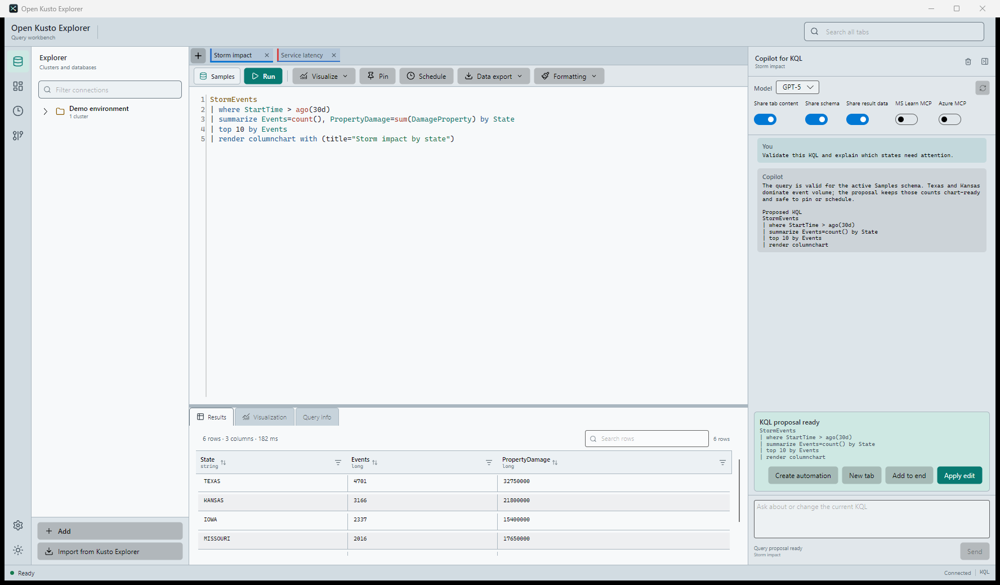
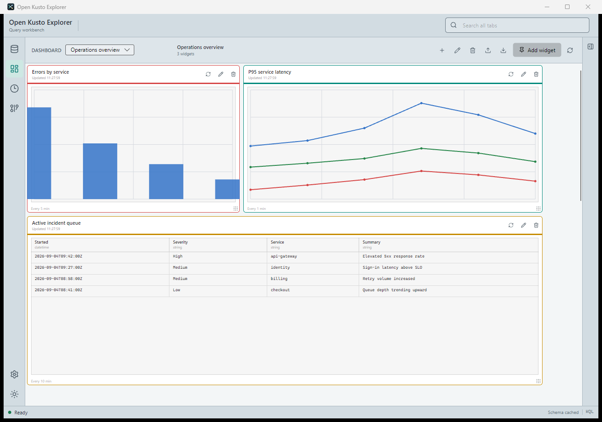
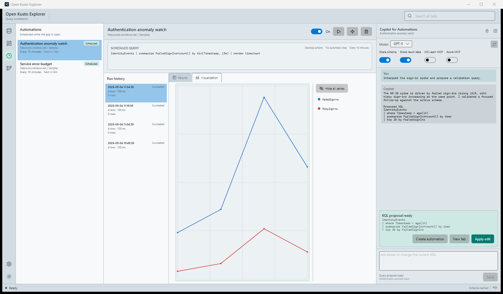
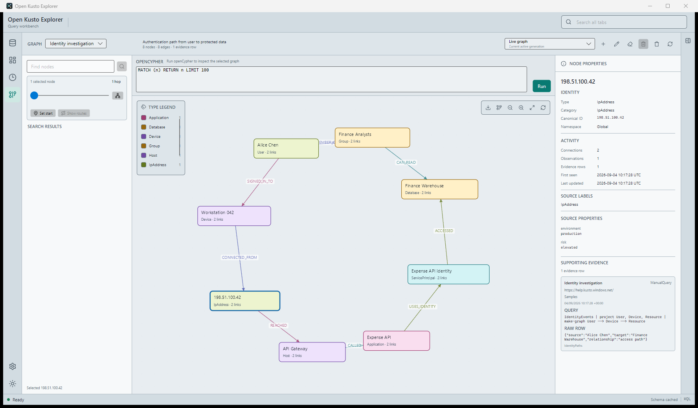
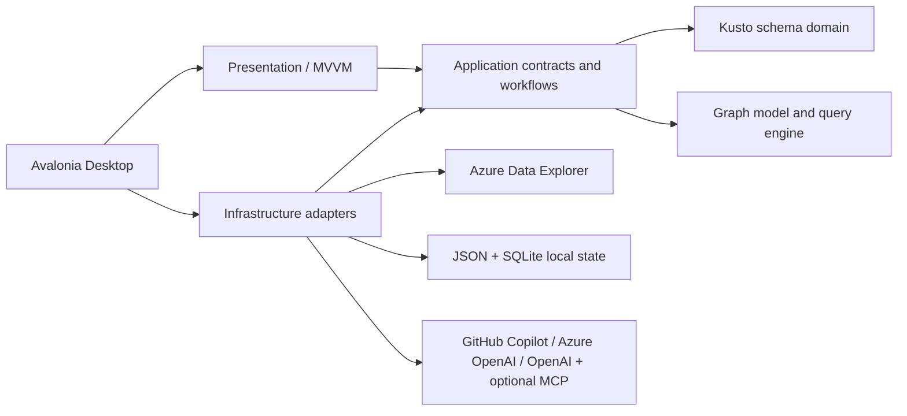

<p align="center">
  
</p>

<h1 align="center">Open Kusto Explorer</h1>

<p align="center">
  <strong>A fast, native desktop workbench for Azure Data Explorer.</strong><br />
  Create and validate KQL with GitHub Copilot, explore results, build dashboards, automate analysis, and follow evidence through investigation graphs.
</p>

<p align="center">
  
  
  
  
  
</p>

Open Kusto Explorer brings the workflows around KQL into one focused application. AI assistance defaults to GitHub Copilot and can instead use Azure OpenAI or OpenAI. It works alongside the schema-aware editor, results, scheduled automations, and evidence graphs to help create valid queries and interpret explicitly shared data. Every generated query remains a proposal, every KQL proposal is checked locally, and every data-sharing boundary stays under your control.

<p align="center">
  <a href="docs/open-kusto-explorer-security-intro.mp4">
    
  </a>
</p>

<p align="center">
  <strong><a href="docs/open-kusto-explorer-security-intro.mp4">Watch the feature overview</a></strong><br />
  <em>See schema-aware KQL, investigation workflows, dashboards, automations, and security analysis in Open Kusto Explorer. MP4, 17 MB.</em>
</p>

## Why Open Kusto Explorer?

- **Create, validate, and interpret with GitHub Copilot.** Turn intent into KQL, catch invalid proposals locally, and reason over only the result or graph context you explicitly share.
- **Stay in the investigation.** Move from query to chart, dashboard, automation, or graph without rebuilding context in another tool.
- **Work like a Kusto power user.** Caret-scoped execution, Kusto.Explorer-style shortcuts, render operators, tab groups, colors, and import are built in.
- **Keep local state local.** Documents, dashboards, schedules, settings, and graph evidence persist on your machine. Credentials do not.
- **Ship a real desktop app.** The UI is native Avalonia, the architecture is trimming-aware, and release bundles are self-contained Native AOT executables.

## One Workbench, Six Workflows

| Workspace | What it gives you |
| --- | --- |
| **Query** | Schema-aware KQL editing, completion, diagnostics, browser-authenticated execution, result inspection, export, and visualization |
| **Dashboards** | Durable named dashboards with shared time ranges and query-backed table and chart widgets on a draggable, resizable snap grid |
| **Automations** | Recurring KQL, retained run history, charts, row-delta triggers, desktop alerts, TLS email, application actions, and webhooks |
| **Sessions** | Named manual-query recordings with retained results, pertinent-value highlighting, inferred pivot chains, and generated follow-up KQL |
| **Graph** | Named local investigation graphs, evidence provenance, historical generations, route finding, and bounded read-only openCypher |
| **AI assistant** | GitHub Copilot by default, or configured Azure OpenAI/OpenAI, with scoped conversations and bounded read-only investigation tools |

## GitHub Copilot Across The Investigation

GitHub Copilot is part of the workbench loop rather than a detached chat window. Its conversation follows the active query tab, automation, or graph generation, so assistance stays grounded in the work you are doing.

| Stage | How Copilot helps |
| --- | --- |
| **Create** | Generate complete KQL, refine the caret-selected query block, append a new query, open a new tab, or turn a proposal into an automation |
| **Validate** | Check proposed KQL locally against the active schema; invalid drafts are withheld and returned privately for bounded repair attempts |
| **Interpret** | Explain current query results or a selected automation run after explicit data consent, or inspect a graph through generation-pinned read-only tools |
| **Act** | Apply an edit, pin the resulting query to a dashboard, schedule it, or load and explicitly run a proposed openCypher query |

Copilot never executes a KQL proposal automatically. You review the complete proposal and choose whether to apply it, add it to the tab, create another tab, or schedule it.

## Query With Context

- Semantic classification, completion, live diagnostics, and contextual syntax help powered by `Microsoft.Azure.Kusto.Language`.
- Multi-query tabs: execution runs the KQL block at or nearest the caret.
- Independent cluster and database targets per tab, plus tab colors, groups, renaming, search, and autosave.
- Multi-file `.kql` import opens local query-tab snapshots that inherit the active tab target.
- Microsoft sign-in through the system browser; database discovery and schema loading happen lazily.
- Cluster context menus expose the complete URL and editable connection properties; URL changes migrate query tabs, dashboard widgets, and future automation runs while retaining historical run provenance.
- Cancellation, execution timing, query details, and automatic handling of Kusto `render` metadata.
- Non-destructive import of open Microsoft Kusto Explorer tabs, connection groups, and cluster registrations on Windows.
- GitHub Copilot can explain or refine the active query, repair a failed query from its diagnostics, and validate every proposed KQL edit before it is shown.

### Results That Do Not Get In The Way

- Virtualized, content-fitted result grids with horizontal overflow handling and per-tab state.
- Local search, multi-column sorting, filtering, alternating rows, and persisted conditional formatting.
- Double-click any cell to open its complete, selectable value in a dedicated output tab.
- Copy values or rows, insert single-value or multi-selection `or` filters into the active query, or generate reusable KQL `datatable` literals.
- Export the displayed filtered/sorted projection to CSV, Excel, JSON, a runnable KQL `datatable()` script, or the clipboard; query-and-result clipboard exports retain the exact executed query block.
- Render time, anomaly, line, area, stacked area, scatter, bar, column, pie, treemap, card, ladder, pivot, and time-pivot views.

## Record An Investigation

Recording is an explicit local capture mode for manual query activity. It retains the query and its bounded results; it does not record the screen, keystrokes, dashboard refreshes, automations, schema discovery, or internal application calls.

### Start And Capture

1. In the Query workspace, select **Start recording session** at the bottom of the Explorer pane.
2. Enter a new session name, or enable **Append to existing session** and choose a previous investigation.
3. Select **Save and start**, then run queries normally with **Run**, `F5`, or `Shift+Enter`. Recording follows manual executions across every query tab.
4. Optionally right-click live result cells to mark a value, mark every retained value in a column, or remove a mark. Matching values are highlighted in later results while the session remains active.
5. Select **Pause** to stop capturing without canceling Kusto queries, **Resume** to open another period in the same named session, or **Stop** to finish. Queries still in flight when Pause is selected are excluded from the recording.

Each execution retains its KQL, source-tab title, cluster and database, start and completion times, duration, outcome, error details, inferred values of interest, and every materialized result table within the capture limits. Failed, canceled, interrupted, capture-failed, and zero-row executions remain visible as investigation history.

| Recording boundary | Limit |
| --- | --- |
| Result capture per execution | 500 rows total across all result tables and a 2 MiB estimated payload |
| Query text per execution | 256 KiB |
| Local catalog | 100 sessions, 500 executions per session, and a 1 GiB SQLite database |

Executions that reach the row or payload boundary are labeled **result limited** rather than appearing complete.

### Review And Annotate

Open the **Sessions** workspace and select a recorded session, then choose an execution to inspect its read-only KQL and retained result tables. Results are paged in groups of 50 rows. From this workspace you can:

- Rename or delete individual recorded queries, delete an entire session, and export all pertinent values as CSV.
- Mark historical values or every retained value in a column, and remove individual value marks; exact typed matches are highlighted throughout the session without replacing conditional formatting.
- Review the **Pertinent values** panel and **Discovery timeline** to see what was inferred from predicates, what you marked manually, and where each value first appeared.
- Set chain start and end points from a result cell, pertinent value, or timeline item.

### Generate A Follow-Up Query

After selecting start and end values, choose **Generate query**. Open Kusto Explorer searches the recorded executions for a weighted, forward-in-time pivot chain and generates KQL only when table lineage, join keys, target, and schema validation are strong enough. A successful result opens in a new query tab targeted to the recorded cluster and database; it is never executed automatically. If no safe chain can be produced, the dialog explains why and lets you return to the investigation to add evidence.

The Sessions workspace also has its own assistant conversation. **Enable session tools** must be turned on explicitly before the assistant can use bounded, read-only tools against the selected session.

### How Values Become Evidence

- Exact `where Column == literal` and literal `in (...)` predicates automatically identify stable string, GUID, and non-sentinel integer values of interest.
- Nulls, empty or very short strings, booleans, datetimes, timespans, dynamic values, and floating-point thresholds are not inferred automatically.
- Mark a result value or every retained value in its column as pertinent from its context menu. Later exact typed matches are annotated without replacing conditional formatting.
- The Sessions workspace retains failed, canceled, interrupted, and zero-row queries as investigation evidence.
- A value declared interesting later can annotate an earlier matching occurrence as **recognized retrospectively**; this does not rewrite its original mark history.
- Select exact start and end values from recorded result cells or the pertinent-values panel to find a weighted, forward-in-time **inferred pivot chain**. Equal values are correlation evidence, not proof of causation.
- Strong same-row predicate-to-pertinent pivots are preferred over generic coincidences. Common and unstable values are excluded from automatic graph edges.
- Generated KQL is offered only when source-column lineage, join keys, target, and predicate simplification can be validated against the active schema. Unsupported or weak chains remain inspectable but are not converted into code.

The SecurityLogs acceptance workflow records URL, IP, authentication, employee, and email exploration. It retains the complete five-query timeline while minimizing the reusable query to the supported `OutboundBrowsing` and `Employees` relations joined on `src_ip` and `ip_addr`.

## Build Operational Dashboards

Draft and validate widget KQL with GitHub Copilot in Query, then pin the caret-selected block directly to a dashboard. Every widget keeps its own Azure Data Explorer target, refresh cadence, display mode, visualization, colors, and snapped layout. Dashboard definitions can be exported and imported as JSON.

Each dashboard stores one shared time range. Existing and new dashboards default to **Last 24 hours**; the toolbar also offers 15 minutes, 1 hour, 6 hours, 7 days, 30 days, and a fixed custom local start/end range. Relative ranges slide to the start of each refresh, while custom values are persisted and executed in UTC. Changing the range clears cached widget results and refreshes the dashboard immediately.

Open Kusto Explorer prepends the Azure Data Explorer dashboard variables `_startTime` and `_endTime` to every widget execution. Widget KQL opts into filtering where it is semantically correct; the application does not guess a timestamp column or inject a `where` operator.

```kusto
Events
| where Timestamp between (_startTime.._endTime)
| summarize Events=count() by bin(Timestamp, 1h)
```



<p align="center"><em>Rendered query-backed charts and tables with independent refresh intervals, themes, and snap-grid layout.</em></p>

## Automate The Repeat Work

Schedule a KQL block without leaving the editor. Open Kusto Explorer retains up to 100 completed runs per automation and lets you inspect the original table or visualization for each run. Each automation also has its own GitHub Copilot conversation for validating follow-up KQL and, with explicit consent, interpreting the selected retained result.



<p align="center"><em>Copilot explains the selected run and produces a locally validated follow-up query without executing it.</em></p>

- Run on an interval while the application is open and catch up one missed occurrence after restart.
- Trigger when row count changes or crosses an `=`, `>=`, `<=`, or `!=` threshold.
- Notify through in-app desktop alerts, TLS email, a local application with templated arguments, or an HTTPS webhook.
- Use `{row_count}`, `{rows_changed}`, `{name}`, and `{query}` in notification templates.
- Feed scheduled `make-graph` and `graph()` results into the active named investigation graph.

A webhook uses exactly one endpoint source: a stored absolute HTTPS URL or the name of an environment variable resolved when delivery begins. Prefer the environment-variable mode for signed or secret-bearing URLs; the resolved value is never persisted or included in an error. Delivery is an HTTP `POST` with `application/json`, redirects disabled, and a 30-second timeout per attempt.

Webhook schema version 1 contains `eventType`, the run ID as `eventId`, automation identity and target, run timestamps and status, row count and signed delta, and the criteria that triggered the action. It deliberately excludes KQL, formatted notification text, result rows or values, credentials, and resolved environment URLs. Network failures, timeouts, HTTP 408, 429, and 5xx responses are retried after 1 and 2 seconds. Consumers should deduplicate possible repeat delivery with `eventId`; delivery failure is reported without changing the successful automation run or schedule.

## Follow The Evidence

Investigation graphs are durable, named, and local. Query output can add to or replace the active generation while retaining provenance and historical timeline points.



- Explore a bounded overview, expand neighborhoods, hide types, prune branches, and find shortest routes.
- Select nodes or relationships to inspect source labels, latest properties, observation counts, timestamps, creating KQL, and raw supporting rows.
- Switch to a retained generation for a read-only historical view without rewriting current state.
- Query the selected generation with a bounded read-only openCypher subset compiled to parameterized SQLite.
- Export the visible graph to PNG or GraphML, including manually adjusted positions.
- Ask GitHub Copilot to interpret graph structure through four generation-pinned tools, then review, load, or explicitly run its openCypher proposal.

The openCypher surface supports one node or one fixed relationship pattern, property maps, Boolean `WHERE` expressions, string predicates, typed projections, `DISTINCT`, `count`, ordering, pagination, and limits. Write clauses, variable-length paths, multi-relationship patterns, subqueries, and cross-graph queries are intentionally rejected.

## Consent And Tool Boundaries

The right-side panel uses the official `GitHub.Copilot.SDK` by default. Azure OpenAI and OpenAI use their official .NET SDKs through `Microsoft.Extensions.AI`. Capabilities are deliberately scoped, bounded, and opt-in where application data is involved.

- Query context can include the active target and selected schema. Complete tab text and current result data are separately controlled.
- Automation context includes the schedule and KQL. Sharing the selected retained result requires separate consent.
- Result sharing is opt-in and capped at 50 columns, 50 rows, 500 characters per cell, and 20,000 total characters in both Query and Automation scopes.
- Suggested KQL remains an explicit proposal: apply it to the caret-selected block, append it, open a new tab, or create an automation.
- Graph sharing enables exactly four read-only in-process tools: schema, bounded openCypher, one entity lookup, and shortest-route lookup.
- Graph tool output is generation-pinned, capped at 64 KiB, and never includes raw evidence payloads.
- Microsoft Learn MCP and Azure MCP are disabled by default and must be enabled independently.

### AI Providers

Choose the provider under **Application settings → AI**. Provider clients are initialized only when the assistant is used, so a missing Copilot CLI, absent subscription, unavailable endpoint, or offline network does not affect query editing, execution, dashboards, automations, recorded sessions, or graphs.

- **GitHub Copilot** is the default. Authentication can use `COPILOT_GITHUB_TOKEN`, `GH_TOKEN`, `GITHUB_TOKEN`, GitHub CLI credentials, or the official Copilot CLI sign-in.
- **Azure OpenAI** requires an endpoint and deployment. It uses the API key from the configured environment-variable name when present; otherwise it uses `DefaultAzureCredential` and Microsoft Entra authentication.
- **OpenAI** requires a model and an API key in the configured environment variable. Its optional endpoint supports OpenAI-compatible gateways and local services.

API keys are never entered into or persisted by Open Kusto Explorer. Settings store only endpoints, model or deployment names, and environment-variable names. GitHub-only Microsoft Learn and Azure MCP options are hidden for other providers; bounded local graph and recorded-session tools remain available with explicit consent.

Azure MCP additionally requires Node.js with `npx` and an authenticated Azure credential chain.

## Quick Start

### Prerequisites

- .NET SDK `10.0.302` (pinned by [global.json](global.json))
- Windows 11 or a supported x64 Linux desktop
- An Azure Data Explorer endpoint and Microsoft identity for remote query execution

AI provider and Azure MCP dependencies are optional at runtime; the core query, dashboard, automation, session, and graph workflows do not require an account or network connection.

### Run From Source

```powershell
dotnet restore OpenKustoExplorer.slnx
dotnet run --project src/OpenKustoExplorer.Desktop --configuration Release
```

Then:

1. Select **Add** in Explorer and enter an Azure Data Explorer cluster URL.
2. Complete Microsoft sign-in in the system browser.
3. Select a database to load its schema and associate it with the active tab.
4. Write KQL and press `F5` or `Shift+Enter`.
5. Explore the table, select a visualization, pin the query, or schedule it.

The initial workspace includes a local Help-cluster schema snapshot, so editor intelligence is available before the first connection is added.

After the main window opens, the application makes one unauthenticated request to the official GitHub `releases/latest` endpoint. When a newer stable release exists, a small **Update** button appears in the top-right toolbar and opens the official release page. Open Kusto Explorer does not download or install updates automatically, and an offline or unavailable GitHub endpoint does not interrupt startup.

## Keyboard Essentials

| Shortcut | Action |
| --- | --- |
| `F5` or `Shift+Enter` | Run the query block at the caret |
| `Esc` or `Shift+F5` | Cancel the active query |
| `F1` | Show or refresh modeless help, with official Microsoft Learn links when available |
| `Ctrl+O` | Import one or more `.kql` files into new query tabs |
| `Ctrl+Space` | Open schema-aware completion |
| `Ctrl+Enter` | Insert a new line and pipe |
| `Ctrl+Shift+F` | Search titles and KQL across open tabs |
| `F6` | Move focus through major workbench regions |

Additional bindings follow the [Kusto.Explorer keyboard shortcut reference](https://learn.microsoft.com/kusto/tools/kusto-explorer-shortcuts?view=azure-data-explorer&preserve-view=true) when the corresponding feature exists.

## Local Data And Security

Application state lives under the platform's local application-data directory. On Windows, that is `%LocalAppData%\OpenKustoExplorer`.

| File | Contents |
| --- | --- |
| `connections.json` | Cluster and database catalog plus cached schemas; no credentials |
| `documents.json` | Open tabs, text, caret positions, groups, colors, targets, and formatting rules |
| `dashboards.json` | Dashboard definitions, shared time ranges, widget KQL, layout, refresh, and themes |
| `automations.json` | Schedules, notification settings and endpoint sources, and bounded run history |
| `settings.json` | Theme, density, text size, AI provider metadata, and assistant defaults; never API keys |
| `graph.db` | Named graph generations, observations, relationships, and evidence |
| `recorded-sessions.db` | Recorded manual KQL, retained results, inferred interests, marks, endpoints, and pivot evidence |

- Authentication tokens and account photos remain in memory for the current process.
- SMTP credentials are read only from `OPENKUSTOEXPLORER_SMTP_USERNAME` and `OPENKUSTOEXPLORER_SMTP_PASSWORD`.
- Environment-backed webhook URLs are resolved only for delivery and are never written to local state.
- Kusto Explorer import excludes credentials, query history, cached result payloads, and source application settings.
- Copilot result, graph, Learn MCP, and Azure MCP sharing are independently gated.
- Recorded sessions are local, unencrypted per-user data with no automatic retention. Delete sensitive sessions explicitly from the Sessions workspace. Result rows are available to the assistant only through consented, session-pinned tools with strict row and output bounds.

## Architecture



| Project | Responsibility |
| --- | --- |
| `OpenKustoExplorer.Domain` | Immutable Kusto schema model |
| `OpenKustoExplorer.Application` | Use-case contracts and durable definitions |
| `OpenKustoExplorer.Graph` | Graph domain, bounded queries, and layout contracts |
| `OpenKustoExplorer.Infrastructure` | ADX, persistence, graph SQLite, import, and AI provider adapters |
| `OpenKustoExplorer.Presentation` | Workbench state, commands, projections, and view models |
| `OpenKustoExplorer.Desktop` | Avalonia UI, platform integration, charts, and automation dispatch |

The solution uses dependency injection in-process. JSON is handled through explicit trimming-safe readers and writers, and release builds enforce trimming and Native AOT analysis.

## Build And Verify

```powershell
dotnet restore OpenKustoExplorer.slnx
dotnet format OpenKustoExplorer.slnx --verify-no-changes --no-restore
dotnet build OpenKustoExplorer.slnx --configuration Release --no-restore -warnaserror
dotnet test OpenKustoExplorer.slnx --configuration Release --no-build --no-restore
```

CI runs a fail-closed direct/transitive NuGet vulnerability audit, formatting, warning-free builds, tests, Native AOT smoke execution, and desktop publication on Windows and Linux. CodeQL separately analyzes C# security and quality on pull requests, main pushes, and a weekly schedule. Dependabot checks centrally managed NuGet packages and GitHub Actions weekly, grouping compatible minor/patch updates while leaving major updates for individual review. Every successful push event to `main` then creates one stable GitHub release and matching source tag; pull requests, manual CI runs, and failed builds create neither.

### Performance Tracing

Set `OPENKUSTOEXPLORER_PERF_LOG` to an output path before launching the app to capture startup, result projection, workspace switching, dashboard, automation, recorded-session, and graph timings. Records are buffered and flushed on normal shutdown as tab-separated timestamp, operation, duration, item count, managed-memory, and working-set fields. The trace contains stable operation names and counts, not query text or workspace labels.

```powershell
$env:OPENKUSTOEXPLORER_PERF_LOG = "$PWD\artifacts\performance\profile.tsv"
dotnet run --project src/OpenKustoExplorer.Desktop
```

The same durations are emitted from the `OpenKustoExplorer.Performance` `System.Diagnostics.Metrics` meter for compatible runtime diagnostics tools.

## Automatic Releases

`VersionPrefix` in `Directory.Build.props` is the floor for the current release series. CI derives a deterministic patch version from first-parent `main` history and passes it to every build and publish command, so the packaged assembly and generated `vMAJOR.MINOR.PATCH` tag always agree. The first commit carrying a new floor receives that exact version; later main commits increment its patch component. A push containing several commits or a failed earlier release can therefore leave unused patch numbers, but published SemVer ordering remains monotonic.

For a breaking release, bump the major floor before merging the breaking-change pull request:

```powershell
pwsh ./scripts/Bump-MajorVersion.ps1
```

Review and commit the resulting `Directory.Build.props` change in that pull request. For example, a `1.x` floor becomes `2.0.0`; that merge publishes `v2.0.0`, and subsequent successful main pushes publish `v2.0.1`, `v2.0.2`, and so on. Use `-WhatIf` to preview the change. A merge commit or squash merge naturally places the new floor on the release commit. When using rebase merge, make the version-floor change the final commit so that earlier rebased commits do not intentionally advance the patch component. Do not run the bump only after the breaking changes have already merged, because their automatic patch release will already have been created.

The release job begins only after both platform quality jobs pass. It attaches versioned Windows and Linux Native AOT archives plus separate symbol archives, creates the source tag at the triggering main commit, and reconciles the highest stable SemVer as GitHub's latest release. CI never edits or commits version files back to `main`. Repository policy must allow the release job's scoped `contents: write` permission, and published main history should not be force-rewritten.

## Publish Native AOT Manually

Manual local publications use the current `VersionPrefix`; official releases are produced by CI as described above.

Windows x64:

```powershell
dotnet publish src/OpenKustoExplorer.Desktop `
  --configuration Release `
  --runtime win-x64 `
  --output artifacts/desktop `
  -warnaserror
```

Linux x64 must be published on Linux because Native AOT does not cross-compile:

```bash
dotnet publish src/OpenKustoExplorer.Desktop \
  --configuration Release \
  --runtime linux-x64 \
  --output artifacts/desktop \
  -warnaserror
```

The published bundle is self-contained; the target machine does not need a separate .NET runtime.

## Current Boundaries

- Interactive query results are materialized up to 10,000 rows; export and visualization operate on that bounded result.
- One `.kql` import processes up to 100 files of at most 1 MiB each; UTF-8 and BOM-marked UTF-16 are supported.
- Session recording persists up to 500 rows per execution across all result tables and labels capped executions as limited.
- Generated pivot queries currently require one cluster/database and conservative direct table-column lineage.
- Scheduled automations run while Open Kusto Explorer is open and catch up at most one missed occurrence.
- Historical graph views are read-only, and all graph rendering/query operations enforce explicit bounds.
- Native AOT desktop bundles must be published on their target operating system.

## Contributing

Keep changes focused, preserve the project boundaries above, and include tests proportional to the behavior being changed. A contribution is ready when formatting, the warning-free Release build, the full test suite, and relevant Native AOT checks pass.

Screenshots use synthetic sample data and reserved example identities; no production data or credentials are included.
